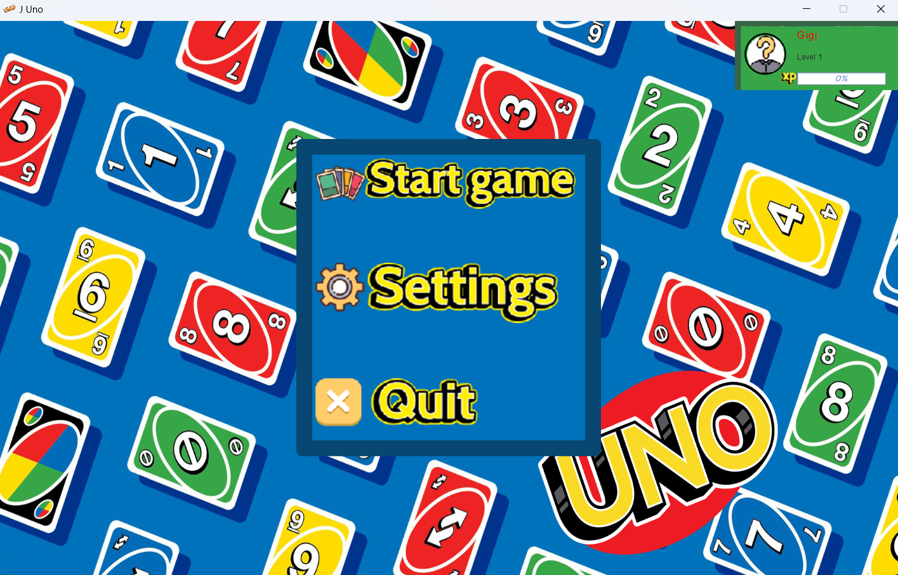
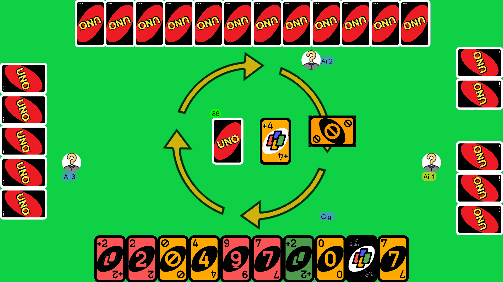
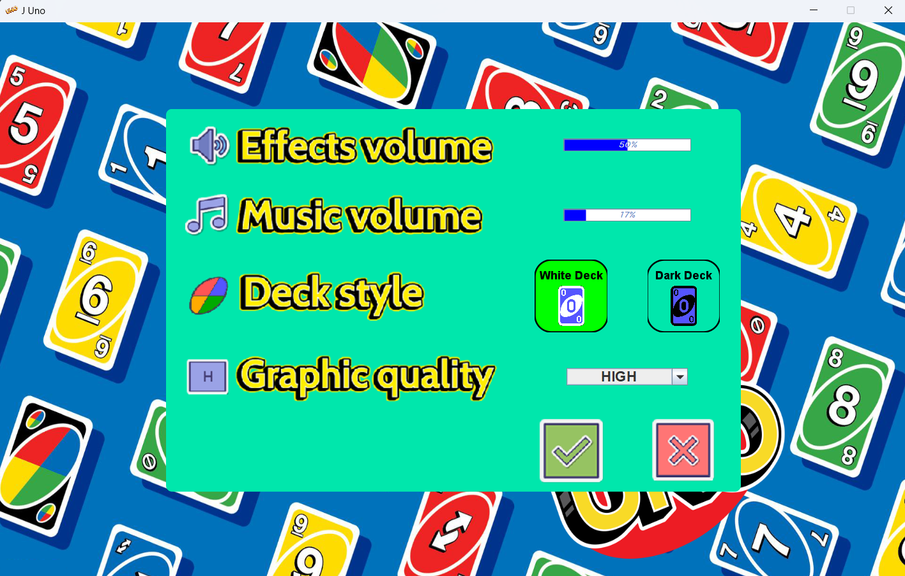
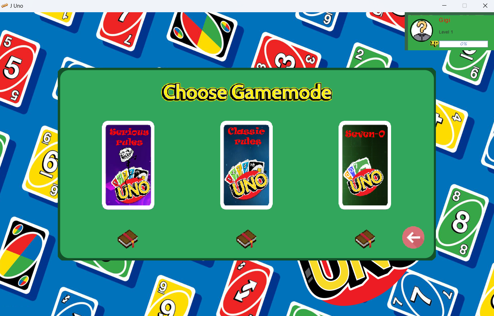
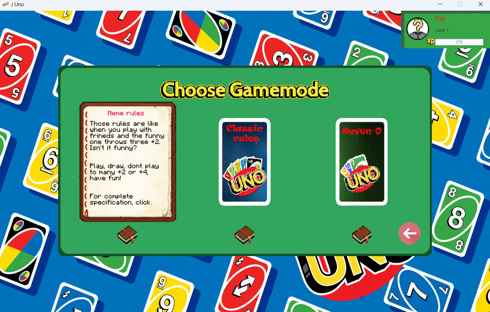
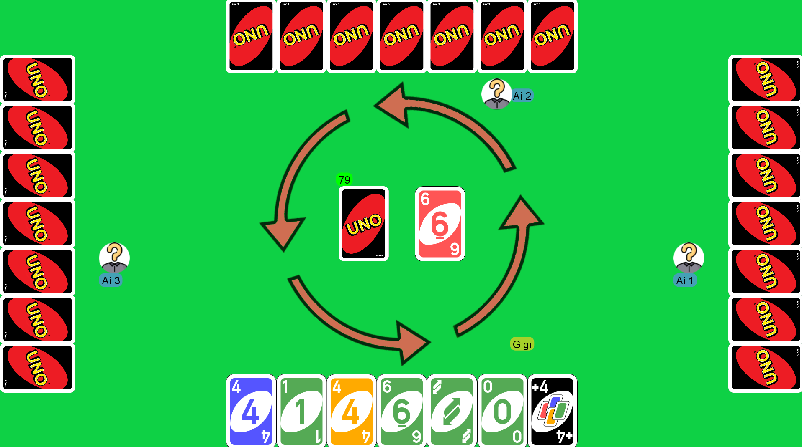

# JUNO 
## Indice
1. [Compito assegnato](#compito-assegnato)
2. [Dettagli](#dettagli)
3. [Immagini demo del gioco](#immagini-demo-del-gioco)
4. [Autori](#autori)

## Compito assegnato
Progettare e sviluppare la versione giocabile in Java del gioco UNO - con lo sviluppo obbligatorio di 3 modalità diverse di gioco, e di animazioni ed effetti speciali, effetti audio,  e delle specifiche da 1 a 8:

1) Gestione del profilo utente, nickname, avatar, partite giocate, vinte e perse, livello ...
2) Gestione di una partita completa in modalità classica con un giocatore umano contro 3 giocatori artificiali
3) Uso appropriato di MVC [1,2], Observer Observable e di altri Design Pattern
4) Adozione di Java Swing [2] o JavaFX [3] per la GUI
5) Utilizzo appropriato di stream
6) Riproduzione di audio sample (si veda appendice AudioManager.Java)
7) Animazioni ed effetti speciali
8) Almeno altre 2 modalità oltre a quella classica

## Dettagli
È stato scelto di utilizzare il pattern
Model-View-Controller per strutturare il codice
in modo da separare interamente la gestione
dell’interfaccia utente, e la gestione del codice
esclusivamente legato al modello del gioco.
L’interfaccia utente infatti oltre a mostrare le
viste di gioco deve occuparsi anche di gestire
l’esperienza di gioco dell’utente e deve essere
tarata in base all’utente finale,
invece il modello ha un compito molto più
astratto e generico, gestire partite del gioco di
carte Uno.
Astrarre il modello, ha come obiettivi principali
il rendere il codice riutilizzabile, e di renderlo
indipendente dall’interfaccia grafica associata.

È stato scelto di associare al pattern MVC, il
pattern Observer-Observable, quindi modellare il
tavolo di gioco come osservabile e poi andare a
registrare la vista come osservatrice.
Questo consente la comunicazione diretta dal
tavolo di gioco alla vista mentre la
comunicazione tra vista e tavolo di gioco è più
articolata, cioè gli eventi in ingresso della vista
vengono registrati dal controllo che ne delega la
gestione al tavolo di gioco.

## Immagini demo del gioco
 
 
 
 
 
 

## Autori

* [Luigi D'annibale (Me)](https://luigidannibale.github.io)
* [Daniele Venturni](https://github.com/Dalphan)
